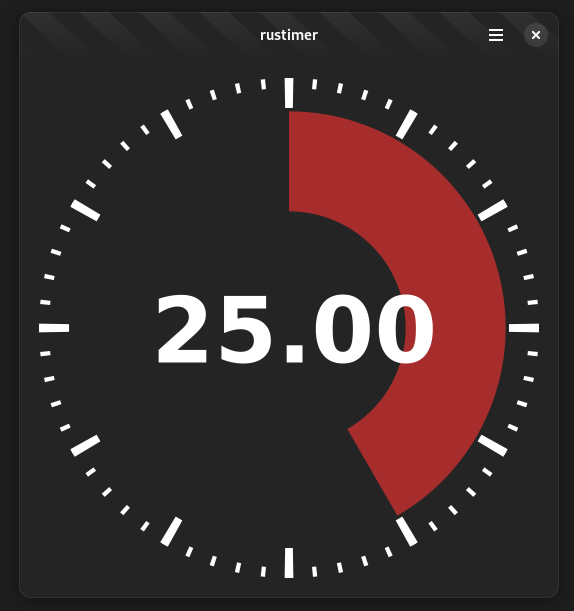

# Rustimer

A simple 60 minutes timer for Gnome using GTK4 + Adwaita + Rust. 

Project generated with Gnome Builder(45.0)

TimerWidget is a custom widget with a custom drawing method (snapshot).

# TODO:

    [ ] Add alarm sound when timer runs out
    [ ] Add shaking/flashing effect when timer runs out
    [?] Add progress icon to System status bar

# Building

This project should be buildable with Gnome Builder.

For command line build, try:

    meson setup build_folder
    meson compile -C build_folder
    meson install -C build_folder
